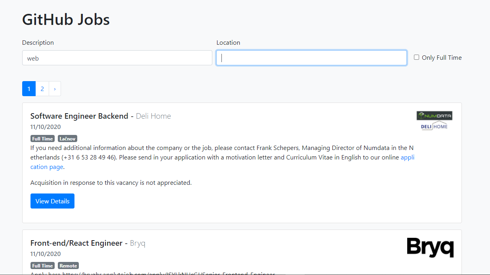

<h1 align="center">GitHub Jobs</h1>

<p align="center">
  
  
  
  
  
  
  
</p>



<h2 align="center"><a href="https://solomangarcia.github.io/react-github-jobs-app/" target="_blank">Visit Live Site</a></h2>

## Description

Github Jobs is an app built with React that utilizes the <a href="https://jobs.github.com/api" target="_blank">GitHub Jobs Api</a>.  This app allows a user to search for jobs by job description and location.

## How to Use

Enter a job description such as web developer in in the description search field, enter a location such as Denver in the location search field and check the Only Full Time checkbox if you wish to see only jobs that are full time.  The app will then load a list of current job listings pulled from the <a href="https://jobs.github.com/api" target="_blank">GitHub Jobs Api</a> using the description, location, and full time status provided.  

## About the Project

### Technologies Used

* React
* JavaScript

### Packages Used

* Axios
* React-Bootstrap
* React-Markdown

## Project setup

```
 clone directory
 run npm install
 run npm start

```


